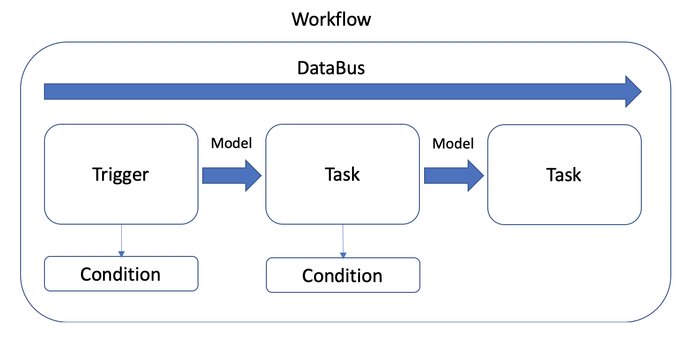

# Workflows add Drag & Drop automation's to your Laravel application.

[](https://packagist.org/packages/the42coders/workflows)
[](https://travis-ci.org/42coders/workflows)
[](https://github.styleci.io/repos/295739465/shield)
[](https://packagist.org/packages/the42coders/workflows)


The Workflow Package adds Drag & Drop Workflows to your Laravel Application. A Workflow consists of Triggers and Tasks. 
The Trigger is responsible for starting a Workflow. The Tasks are single nodes of code execution. 
The package comes with some handy tasks bundled, but you can easily write your own as well.



If you are interested in news and updates 
- Follow me on [Twitter](https://twitter.com/gwagwagwa) && || register to our [Newsletter](https://workflows.42coders.com)

[Video Tutorial](http://www.youtube.com/watch?v=J-fplZGlTZI "Short Introduction Video")

[](https://www.youtube.com/watch?v=J-fplZGlTZI)

## Installation

You can install the package via composer:

```bash
composer require the42coders/workflows
```

You need to register the routes to your web.php routes File as well.
Since the Workflow Package is very powerful make sure to secure the routes with whatever authentication
you use in the rest of your app. 

```php
Route::group(['middleware' => ['auth']], function () {
    \the42coders\Workflows\Workflows::routes();
});
```

You need to publish the assets of the Package

```bash
php artisan vendor:publish --provider="the42coders\Workflows\WorkflowsServiceProvider"  --tag=assets  
```

Other publishable Contents are

config

```bash
php artisan vendor:publish --provider="the42coders\Workflows\WorkflowsServiceProvider"  --tag=config  
```

language

```bash
php artisan vendor:publish --provider="the42coders\Workflows\WorkflowsServiceProvider"  --tag=lang  
```

views

```bash
php artisan vendor:publish --provider="the42coders\Workflows\WorkflowsServiceProvider"  --tag=views  
```

## Usage

The Workflow Package is working out of the Box in your Laravel application. Just go to the route /workflows 
to get started.


### Workflows

A Workflow is gets started by a Trigger and then executes the Tasks in the Order you set them. 
To pass information between the Tasks we have the DataBus. 

### Triggers

A Trigger is the Starting Point and defines how a Workflow gets called. More Triggers coming soon.

#### ObserverTrigger

The Observer Trigger can listen to Eloquent Model Events and will then pass the Model which triggered the Event to the 
Workflow.

To make it Work add the WorkflowObservable to your Eloquent Model. 

``` php
 use WorkflowObservable;
```

#### ButtonTrigger

The Button Trigger is able to render a button in your "frontend" and Execute a Workflow based by a click on it. 
ButtonTrigger also accept an Model which they pass to the Workflow.

You can influence the buttons by adding your own classes or styles directly to each ButtonTrigger.
Also you can publish the blade and change it according to your needs.

You have multiple ways of rendering ButtonTrigger.

##### ByName
``` php
 {!! the42coders\Workflows\Triggers\ButtonTrigger::renderButtonByName('name', $model) !!}
```

##### ByWorkflowId
``` php
 {!! the42coders\Workflows\Triggers\ButtonTrigger::renderButtonByWorkflowId(workflow_id, $model) !!}
```

##### ByCategory
This will return all Triggers from the Category.

``` php
 {!! the42coders\Workflows\Triggers\ButtonTrigger::renderButtonsByCategory('categoryName', $model) !!}
```


### Tasks

A Task is a single code execution Node in the Workflow. 

Task | Description
---- | -----------
ChangeModel | Changes an Eloquent Model (Its not saving the changes to the DB)
DomPDF | The DomPDF Task offers you a way to generate a PDF from HTML and put it to the DataBus (Works great with the HtmlInput Task).
Execute | The Execute Task offers you to execute Shell Commands and is able to push the output of them to the DataBus.
HtmlInput | The HtmlInput Task offers you a Trix Input Field which is able to render Blade. You can put in placeholders for dynamic content in two Ways. From the Model passed through the Workflow or from the DataBus.
HttpStatus | The HttpStatus offers you a way to receive the Http Status of a given URL.
PregReplace | The PregReplace Task offers you a way to to a preg replace on a Value from the Model or a DataBus Variable.
LoadModel | Loads an Eloquent Model from the DB. You can provide the Class and the id.
SaveFile | The SaveFile Task allows you to save Data to a File. Works easily with your registered Storage defines.
SaveModel | Saves an Eloquent Model.
SendMail | The SendMail Task allows you to send a Mail. You can pass the Content and Attachments to it. (Works great with HtmlInput and DomPDF) 
SendSlackMessage | This Task let you send a Slack Message. Please read the Section about Slack Notifications to make your app ready too use this. 

#### SendSlackMessage

To send Slack messages you need to follow this 3 points.
1. You need to install Slack notifications [Laravel Slack Documentation](https://laravel.com/docs/8.x/notifications#slack-notifications)
2. You need to set up an incoming Slack Webhook [Slack Documentation](https://api.slack.com/messaging/webhooks)
3. Set the WebhookUrl to your env file with WORKFLOW_SLACK_CHANNEL=YourSlackWebhookUrl

### DataBus

The DataBus is a way to pass information between the single Tasks. This keeps the Tasks independent of each other.

Resource | Description
---- | -----------
ValueResource | The Value Resource is the simplest Resource. You can just write your Data in an input field.
ConfigResource | The Config Resource lets you access values from your Config Files.
ModelResource | The ModelResource lets you access the Data from the passed Eloquent Model.
DataBusResource | The DataBusResource lets you access the Data from the DataBus. This means all values which got set by a previous Task are access able here.


### Testing

``` bash
composer test
```

### Changelog

Please see [CHANGELOG](CHANGELOG.md) for more information about what has changed recently.

## Contributing

Please see [CONTRIBUTING](CONTRIBUTING.md) for details.

### Security

If you discover any security related issues, please email max@42coders.com instead of using the issue tracker.

## Credits

- [Max Hutschenreiter](https://github.com/42coders)
- [All Contributors](../../contributors)
- jerosoler for [Drawflow](https://github.com/jerosoler/Drawflow)

## License

The MIT License (MIT). Please see [License File](LICENSE.md) for more information.

## Laravel Package Boilerplate

This package was generated using the [Laravel Package Boilerplate](https://laravelpackageboilerplate.com).
